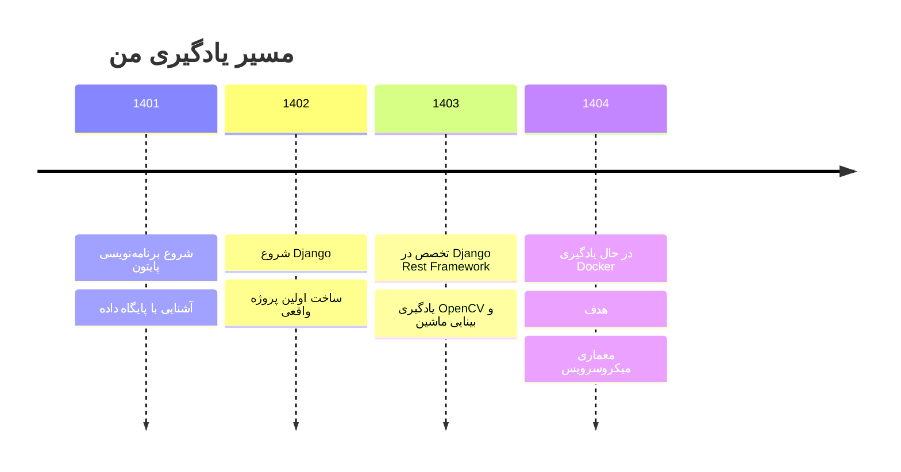

 

  

**👨‍💻 درباره من**  
🔹 18 ساله | ۲ سال سابقه تخصصی در Django  
🔹 علاقه‌مند به Backend، API Design، و بینایی ماشین  
🔹 عاشق حل مسئله و یادگیری تکنولوژی‌های جدید  
🔹 در حال یادگیری معماری میکروسرویس و Docker  

---

## 📊 آمار گیت‌هاب

 

---

## 🛠️ مهارت‌ها و ابزارهای من

### 🔙 تخصص اصلی

### 🔜 بینایی ماشین

### 🎨 فرانت‌اند (مقدماتی)

### 🛠️ ابزارها

---

## 📈 مسیر پیشرفت من

---

## ✨ نقل قول برنامه‌نویسی موردعلاقه من

> "First, solve the problem. Then, write the code."  
> — *John Johnson*

---

## 📫 راه‌های ارتباطی

📧 ایمیل: mobin.hasanghasemi.m@gmail.com  
💬 تلگرام: @mobinhasanghasemi  
🔗 لینکدین: [mobin-hasanghasemi](https://linkedin.com/in/mobin-hasanghasemi)  
🐙 گیت‌هاب: [mobinhasanghasemi](https://github.com/mobinhasanghasemi)

---

<!-- گیف خنک در انتها -->

  
   
  

