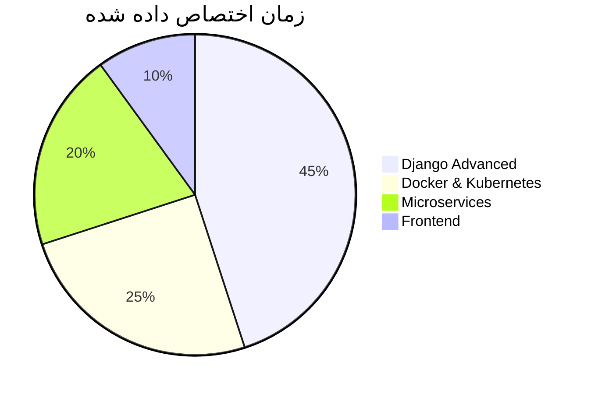

 

  

---

##  **درباره من**

  
<table>
  <tr>
    <td>
      
    </td>
    <td>
      <ul>
        <li>🔹 <b>سن:</b> 18 سال | <b>تجربه:</b> ۲ سال تخصصی Django</li>
        <li>🔹 <b>موقعیت:</b> ایران 🇮🇷</li>
        <li>🔹 <b>تمرکز اصلی:</b> Backend Development, API Design, OpenCV</li>
        <li>🔹 <b>در حال یادگیری:</b> Docker, Kubernetes, Microservices</li>
        <li>🔹 <b>هدف:</b> تبدیل شدن به یک Software Architect حرفه‌ای</li>
        <li>🔹 <b>علاقه‌مندی:</b> حل مسئله، منبع‌باز، تدریس برنامه‌نویسی</li>
      </ul>
    </td>
  </tr>
</table>

---

## 📊 **آمار گیت‌هاب من**

  

  

---

## 🛠️ **مهارت‌ها و تکنولوژی‌ها**

### 🚀 **تخصصی‌ترین مهارت‌ها**

### 📚 **سایر مهارت‌ها**

---

## 🚀 **پروژه‌های شاخص**

| 🏆 پروژه | 📝 توضیحات | 🛠️ تکنولوژی |
|----------|------------|--------------|
| [**E-Commerce Platform**](https://github.com/mobinhasanghasemi/django-shop) | فروشگاه آنلاین کامل با سبد خرید، پرداخت، تخفیف‌ها و پنل مدیریت حرفه‌ای | Django, DRF, Redis, Celery |
| [**Face Recognition System**](https://github.com/mobinhasanghasemi/face-recognition) | سیستم تشخیص و شناسایی چهره در لحظه با دقت ۹۵٪ | OpenCV, Python, NumPy |
| [**Blog CMS**](https://github.com/mobinhasanghasemi/django-blog) | سیستم مدیریت محتوای پیشرفته با امکانات کامل وبلاگ‌نویسی | Django, MySQL, CKEditor |
| [**Booking API**](https://github.com/mobinhasanghasemi/booking-api) | API رزرو نوبت آنلاین با احراز هویت و مستندات کامل | DRF, JWT, PostgreSQL |
| [**Real-time Chat**](https://github.com/mobinhasanghasemi/django-chat) | چت روم آنلاین با قابلیت پیام‌رسانی لحظه‌ای | Django Channels, Redis, WebSocket |

---

## 📈 **نمودار فعالیت**

---

## 🎯 **اهداف یادگیری من**

| ✅ تکمیل شده | 🔄 در حال انجام | 📅 برنامه ریزی شده |
|--------------|----------------|-------------------|
| Django REST Framework | Docker & Containerization | Kubernetes |
| OpenCV Basics | CI/CD Pipeline | GraphQL |
| PostgreSQL Optimization | Redis Caching | Microservices Architecture |
| JWT Authentication | Celery Task Queue | FastAPI |

---

## 🏅 **دستاوردها و گواهی‌ها**

---

## 🔥 **آمار روزانه کدنویسی**

<!-- بازدیدکنندگان پروفایل -->

<!-- آخرین آپدیت -->

---

## ✨ **نقل قول انگیزشی روز**

> "Any fool can write code that a computer can understand. Good programmers write code that humans can understand."  
> — *Martin Fowler*

---

## 📫 **راه‌های ارتباطی با من**

---

 

