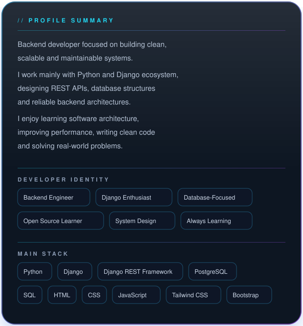
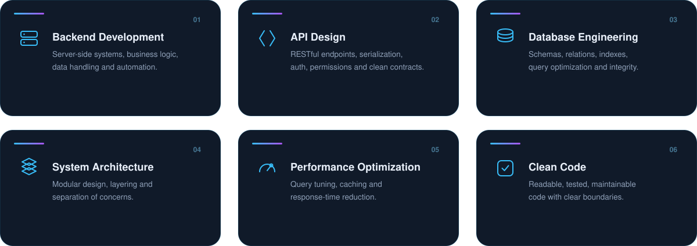
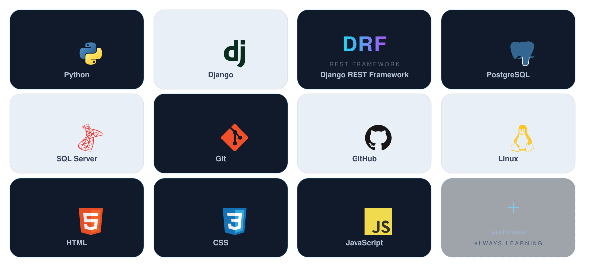

<!-- ============ HERO ============ -->

 

<!-- ============ 01 ABOUT ============ -->

<table align="center">
<tr>
<td width="44%" align="center" valign="middle">

</td>
<td width="56%" valign="middle">

</td>
</tr>
</table>

 

<!-- ============ 02 GITHUB STATS ============ -->

  

 

<!-- ============ 03 SKILLS ============ -->

 

<!-- ============ 04 TECH STACK ============ -->

 

<!-- ============ 05 ACTIVITY ============ -->

  

 

<!-- ============ 06 VISION ============ -->

 

<!-- ============ 07 CONTACT ============ -->

 
 

